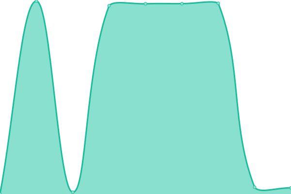

# [📈 Live Status](https://macbrayne.github.io/status): <!--live status--> **🟩 All systems operational**

This repository contains the open-source uptime monitor and status page for [Florentin Schleuß](https://macbrayne.de), powered by [Upptime](https://github.com/upptime/upptime).

With [Upptime](https://upptime.js.org), you can get your own unlimited and free uptime monitor and status page, powered entirely by a GitHub repository. We use [Issues](https://github.com/macbrayne/status/issues) as incident reports, [Actions](https://github.com/macbrayne/status/actions) as uptime monitors, and [Pages](https://macbrayne.github.io/status) for the status page.

<!--start: status pages-->
<!-- This summary is generated by Upptime (https://github.com/upptime/upptime) -->
<!-- Do not edit this manually, your changes will be overwritten -->
<!-- prettier-ignore -->
| URL | Status | History | Response Time | Uptime |
| --- | ------ | ------- | ------------- | ------ |
|  Nextcloud | 🟩 Up | [nextcloud.yml](https://github.com/macbrayne/status/commits/HEAD/history/nextcloud.yml) | 

 2449ms
     
 | 

<a href="https://macbrayne.de/history/nextcloud">100.00%</a>
    

|  Editor | 🟩 Up | [editor.yml](https://github.com/macbrayne/status/commits/HEAD/history/editor.yml) | 

 724ms
     
 | 

<a href="https://macbrayne.de/history/editor">100.00%</a>
    

|  Reverse Proxy | 🟩 Up | [reverse-proxy.yml](https://github.com/macbrayne/status/commits/HEAD/history/reverse-proxy.yml) | 

 690ms
     
 | 

<a href="https://macbrayne.de/history/reverse-proxy">100.00%</a>
    

|  [FRACTAVA Website](https://fractava.com) | 🟩 Up | [fractava-website.yml](https://github.com/macbrayne/status/commits/HEAD/history/fractava-website.yml) | 

 431ms
     
 | 

<a href="https://macbrayne.de/history/fractava-website">98.73%</a>
    

|  Minecraft Server | 🟩 Up | [minecraft-server.yml](https://github.com/macbrayne/status/commits/HEAD/history/minecraft-server.yml) | 

 196ms
     
 | 

<a href="https://macbrayne.de/history/minecraft-server">100.00%</a>
    

<!--end: status pages-->

[**Visit our status website →**](https://macbrayne.github.io/status)

## 📄 License

- Powered by: [Upptime](https://github.com/upptime/upptime)
- Code: [MIT](./LICENSE) © [Florentin Schleuß](https://macbrayne.de)
- Data in the `./history` directory: [Open Database License](https://opendatacommons.org/licenses/odbl/1-0/)
